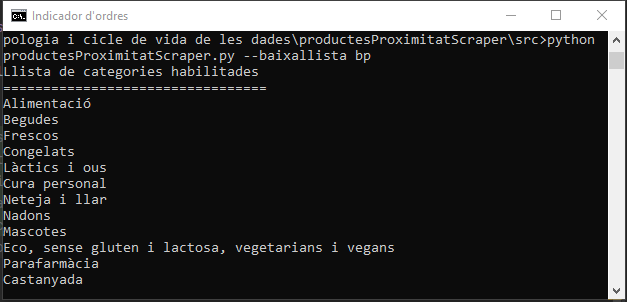
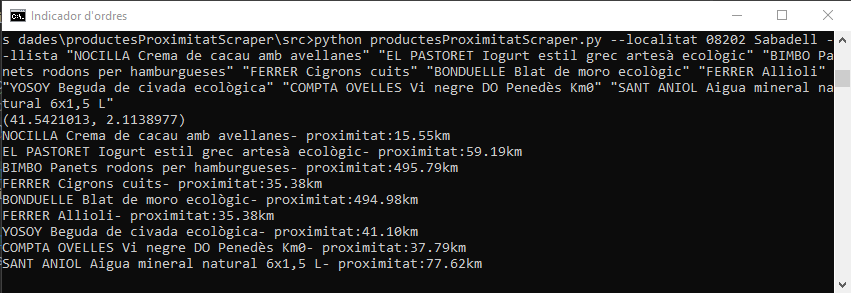
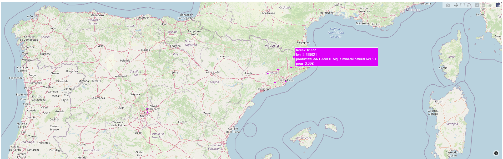

# La proximitat a Bonpreu-Esclat

## Resum

Sovint comprem productes sense conèixer la seva procedència. 
Amb la voluntat de fomentar el quilòmetre 0 i reduïr la petjada de carboni, el scraper captura els productes del catàleg de Bonpreu-Esclat en la recerca de l'origen dels productes.
Aleshores, amb l'ajuda d'una API trobem la longitud i latitud relatives al producte, de forma que en un futur permetin identificar la distància entre el productor i el consumidor.
El resultat és una forma senzilla de contribuir en el objectiu 12 de consum responsable en els The Global Goals 2030.  
&nbsp;\


El sistema permet respondre a preguntes com:
- Existeix un increment de cost entre el producte més pròxim i el més forani?
- Quins són els productes d'una llista de la compra més llunyans? Hi ha un producte alternatiu més pròxim al consumidor?
- Crear un conversor de productes de quilòmetre zero en funció de la ubicació del client.

## Context

Els elements d'aquest repositori constitueixen la resposta a la pràctica de web scraping de l'assignatura *Tipologia i Cicle de vida de les dades* del *Màster en Ciència de Dades* de la Universitat Oberta de Catalunya (UOC), corresponent al primer semestre del curs 2021-2022. Es tracta d'un treball realitzat amb fins acadèmics, i la totalitat dels resultats presentats es comparteixen a la comunitat perquè es pugin usar exclusivament amb fins no comercials.

## Grup de treball

El treball ha estat realitzat en grup, essent-ne els integrants:
- Joan Morral Ventura
- Nicolás González Soler

## Contingut del repositori

- **Readme.md:** exposa breument el contingut de la pràctica
- **src/producteProximitatScrapper.py:** codi font del programa
- **csv/productesProximitat_bonpreu.csv:** dataset resultant de recórrer la tenda en línia de BonPreu-Esclat
- **pdf/productesProximitatScraper.pdf:** document pdf amb les respostes
- **pres/productesProximitatScraper_video.mp4:** gravació de la presentació
- **pres/productesProximitatScraper_slides.pptx:** suport emprat en la presentació del fitxer 
## DOI del dataset generat

El dataset generat porta per títol ***Proximitat de productes venuts a Bonpreu-Esclat.***.  
Es troba emmagatzemat en format CSV a Zenodo, amb DOI: 

## Instruccions d'execució
L'entorn d'execució del programa pot ser des de la mateixa consola o terminal. En un entorn Windows es pot accedir executant la comanda cmd un cop desplegat el menú de inici. Aleshores, cal cercar el directori on es troba el codi i executar-lo posant davant la instrucció python. 

### Càrrega de llibreries necessàries
Per executar el script és necessari instal·lar o tenir instal·lades les següents llibreries Python:

```python
pip install requests
pip install beautifulsoup4
pip install DateTime
pip install pandas
pip install geopy
pip install plotly
```

### Descàrrega del llistat de productes
Per a descarregar la llista del supermercat BonPreu-Esclat cal emprar la següent instrucció:
```python
python productesProximitatScraper.py --baixallista bp
```
  
**Figura 1.** Captura del procés de càrrega

### Consulta de la distància dels articles d'una llista de la compra
La commanda per executar la consulta consta de dos paràmetres:
- paràmetre **--localitat** per posar el CP i població del consumidor
- paràmetre **--llista** acompanyat dels noms dels articles de la tenda de BonPreu-Esclat, cada nom s'ha de posar entre cometes i separant els articles amb espais: **"producte1" "producte2" "producte3"** ... 

A continuació es presenta un exemple: 
```python
python productesProximitatScraper.py --localitat 08202 Sabadell --llista "NOCILLA Crema de cacau amb avellanes" "EL PASTORET Iogurt estil grec artesà ecològic" "BIMBO Panets rodons per hamburgueses" "FERRER Cigrons cuits" "BONDUELLE Blat de moro ecològic" "FERRER Allioli" "YOSOY Beguda de civada ecològica" "COMPTA OVELLES Vi negre DO Penedès Km0" "SANT ANIOL Aigua mineral natural 6x1,5 L"
```

  
**Figura 2.** Captura del procés de consulta de distància de productes

  
**Figura 3.** Captura del mapa que es desplega amb el posicionament de productes


